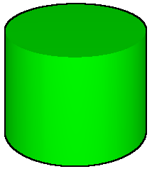

<!--
Copyright 2015-2021 The Khronos Group Inc.
SPDX-License-Identifier: CC-BY-4.0
-->

# EXT_mesh_primitive_edge_visibility

## Contributors

* Paul Connelly, Bentley Systems, [@pmconne](https://github.com/pmconne)

## Status

Draft

## Dependencies

Written against the glTF 2.0 spec.

## Overview

3D modeling and computer-aided drafting environments like SketchUp, MicroStation, and Revit provide non-photorealistic visualizations that render 3D objects with their edges visible. The edges can improve the readability of complex models and convey semantics of the underlying topology. The `EXT_mesh_primitive_edge_visibility` extension encodes the visibility of each edge in a triangle mesh and optionally includes additional primitives that can be used to render some or all of the edges.

The image below illustrates a typical rendering of a cylinder with its edges. The width of the edges has been exaggerated for emphasis.

<figure>

<figcaption><em><b>Figure 1</b> Cylinder mesh with visible edges</em></figcaption>
</figure>

This image shows both of the two types of edges described by `EXT_mesh_primitive_edge_visibility`.
- A [silhouette edge](https://en.wikipedia.org/wiki/Silhouette_edge) is any edge separating a front-facing triangle from a back-facing triangle. In the Figure 1, one silhouette is visible along each of the curved left and right sides of the cylinder. Silhouette edges are *conditionally visible* - their visibility is determined at display time based on the camera direction.
- A hard edge is any edge attached to only a single triangle, or any edge between two logical faces of the 3D object. In the Figure 1, hard edges are visible around the perimeters of the cylinder's circular end caps. Hard edges are *always visible* regardless of the camera direction.

Various techniques can be applied to a glTF model to approximate the rendering in Figure 1. One of the simplest approaches uses only the information encoded in the triangle mesh itself to produce a wiremesh rendering in which every edge of every triangle is visible, as shown in Figure 2.

<figure>

<figcaption><em><b>Figure 2</b> Triangle edges drawn using a wiremesh technique</em></figcaption>
</figure>

The interior edges displayed in Figure 2 can be useful for visualizing the structure of the triangle mesh, but they obscure the semantics of the cylinder topology. Note that each of the vertical edges encircling the cylinder in Figure 2 are potential silhouette edges.

Screen-space techniques (e.g., a "toon shader") can be applied to add edges during image post-processing. Such techniques can only approximate the actual edges. The technique used in Figure 3, for example, fails to reconstruct the edges along the top end cap of the cylinder where they fall within the cylinder's volume projected onto the image plane.

<figure>

<figcaption><em><b>Figure 3</b> Edges drawn using a screen-space technique</em></figcaption>
</figure>

The hard edges could be encoded explicitly into the glTF model as additional primitives to be drawn along with the triangle mesh. However, this will generally produce a "stippling" effect where the edges and triangles collide in the depth buffer, as shown in Figure 4.

<figure>

<figcaption><em><b>Figure 4</b> Edges drawn as separate primitives</em></figcaption>
</figure>

The [CESIUM_primitive_outline](../CESIUM_primitive_outline/README.md) extension attempts to address the depth fighting artifacts shown in Figure 4 by providing an additional index buffer describing each visible edge as a line segment (a pair of indices into the triangle mesh's list of vertices). The extension leaves the details of how to render the edges without depth-fighting up to the implementation. This approach satisfies the use case for which it was intended - displaying the edges of boxy, low-resolution buildings - but suffers some limitations:
- The surface geometry must be represented as indexed triangles.
- Silhouette edges are not supported.
- The representation of the edges are pairs of vertex indices can significantly increase the size of the glTF model.
- The edges cannot specify their own materials.

<figure>

<figcaption><em><b>Figure 5</b> Hard edges encoded using CESIUM_primitive_outline</em></figcaption>
</figure>

## glTF Schema Updates

## JSON Schema

[
  impls MAY render the edge primitives provided
  all edge visibility must be encoded including the edges that have corresponding primitives
  BENTLEY_primitive_restart may be applied to the primitives
    Relevant to naming discussion for that extension?
  Edges MUST draw in front of triangles. No specific implementation prescribed. Some examples.
]
